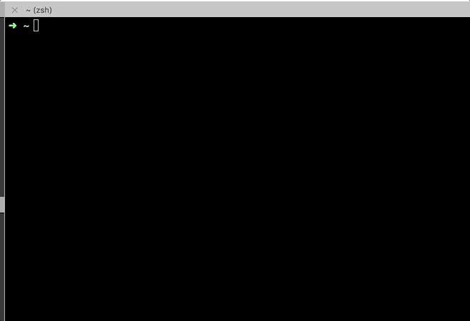
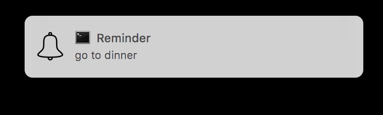

## Terminal Reminder

### Inspiration
I always use to forget some little but important daily life chores when I use to work. Since I spend most of my time on terminal, it's easy for me to just write a command and never miss any task for the day.

## Installation

```
npm install -g remindmee
```

## Usage

```
remindmee <task> <time_in_minutes> &

```




example,

```
remindmee 'go to dinner' 15 &

```


Please feel free to open issues and pull requests.
Also if you liked it, please feel free to star and share.